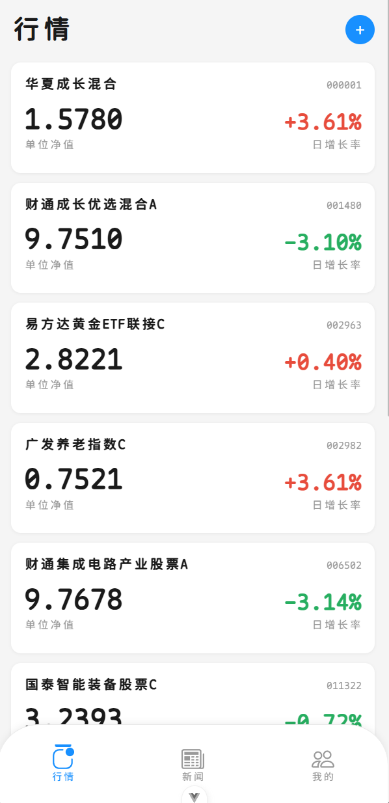

# FunDEX 基研


FunDEX基研是一款致力于解决国内理财软件广告杂乱问题与收费服务乱象的APP。该项目基于Vue和Tauri技术栈，使用Vite构建，全平台可编译。

## FunDEX解决了什么

FunDEX能便捷查看国内基金、国内股票、国际股票等金融信息，数据均来自于东方财富下属的天天基金网。



简洁、便利是FunDEX的视觉设计中心。我们致力于构建一个纯粹的数据软件，而不是营销软件，因此，FunDEX将不支持购入金融产品和相关行为。

## 快速开始

本项目的前端使用Vue+Tauri的解决方案，通过编写Vue前端，不仅在开发过程中能够实时查看热更，还能便捷编写全平台适配。

与此同时，后端使用了Node.js与Python工具混合编写，前端通过调用`server`之中的API，能快捷操作BetterSQLite3库，并将AKShark爬取的数据缓存到DB之中。

使用AKShark包，通过实时获取数据与后端分析，达到展示效果。

首先，请克隆本仓库的主分支。

```Bash
git clone https://github.com/OmaeKumiko529/FunDEX.git
git clone git@github.com:OmaeKumiko529/FunDEX.git
```

或使用CLI：

```Bash
|gh repo clone OmaeKumiko529/FunDEX
```

请注意，克隆完成后，务必检查本项目的关键目录结构。

```Bash
FunDEX/
├── src/          # Vue 前端
├── server/       # Express 后端
├── src-tauri/    # Tauri 桌面端
├── public/       # 静态资源
└── package.json  # 前端依赖清单
```

要开发操作，请先确保您的计算机上已安装以下内容：
- Node.js 22.18.0 或 24.12.0及以上版本
- Python 3.x
- Rust
- Cargo

首先进入项目根目录并安装必要的npm包体：

```Bash
cd FunDEX
npm install
```

等待安装完毕。然后进入`server`目录，同样补全必要的包体：

```Bash
cd server
npm install
pip install akshare --upgrade -i https://pypi.tuna.tsinghua.edu.cn/simple
```

随后运行`seed`脚本初始化sqlite表结构。

```Bash
cd server
npm run seed
```

到此处，所有准备工作已经完备。启动服务的方法如下：

```Bash
cd FunDEX
npm run dev #启动前端服务
npm run tauri:dev #启动tauri桌面服务

cd server
npm run dev #启动后端服务
```

如果有需求，可以使用ADB功能在模拟器或真机上测试。

请先在`.env`中修改`VITE_API_BASE`以明确测试范围。

若您使用Android Studio提供的虚拟机，请写 http://10.0.2.2:3000 ；若您使用无线调试连接真机，请使用 计算机局域网IP+3000端口。